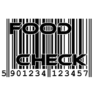

<div id="top"></div>
<!--
*** Thanks for checking out the Best-README-Template. If you have a suggestion
*** that would make this better, please fork the repo and create a pull request
*** or simply open an issue with the tag "enhancement".
*** Don't forget to give the project a star!
*** Thanks again! Now go create something AMAZING! :D
-->


<!-- PROJECT SHIELDS -->
<!--
*** I'm using markdown "reference style" links for readability.
*** Reference links are enclosed in brackets [ ] instead of parentheses ( ).
*** See the bottom of this document for the declaration of the reference variables
*** for contributors-url, forks-url, etc. This is an optional, concise syntax you may use.
*** https://www.markdownguide.org/basic-syntax/#reference-style-links
-->
[![Contributors][contributors-shield]][contributors-url]
[![Forks][forks-shield]][forks-url]
[![Stargazers][stars-shield]][stars-url]
[![Issues][issues-shield]][issues-url]
[![MIT License][license-shield]][license-url]
[![LinkedIn][linkedin-shield]][linkedin-url]


<div align="center">
<a href="https://github.com/github_username/repo_name">
    
  </a>
<h3 align="center">Foodcheck</h3>


  <p align="center">
    App developed as a part of Engineering Thesis at Warsaw Univeristy of Technology. Developed as a help to keep diet and overview nutritional values eaten.
    <br />
    <a href="https://github.com/foltysM/foodCheck-Android-Java"><strong>Explore the docs »</strong></a>
    <br />
    <br />
    <a href="https://github.com/foltysM/foodCheck-Android-Java">View Demo</a>
    ·
    <a href="https://github.com/foltysM/foodCheck-Android-Java/issues">Report Bug</a>
    ·
    <a href="https://github.com/foltysM/foodCheck-Android-Java/issues">Request Feature</a>
  </p>
</div>


<!-- TABLE OF CONTENTS -->
<details>
  <summary>Table of Contents</summary>
  <ol>
    <li>
      <a href="#about-the-project">About The Project</a>
      <ul>
        <li><a href="#main-features">Main features</a></li>
        <li><a href="#app-contents">App contents</a></li>
        <li><a href="#built-with">Built With</a></li>
      </ul>
    </li>
    <li>
      <a href="#getting-started">Getting Started</a>
      <ul>
        <li><a href="#installation and usage">Installation and usage</a></li>
      </ul>
    </li>
    <li><a href="#usage">Usage</a></li>
    <li><a href="#contributing">Contributing</a></li>
    <li><a href="#license">License</a></li>
    <li><a href="#acknowledgments">Acknowledgments</a></li>
  </ol>
</details>


<!-- ABOUT THE PROJECT -->
## About The Project

Aim for the project was to create so called "live fit helper" app. It was designed to measure all nutritional values eaten, basing on food products database. User can mark products as favorite, set goals and review the history of scans. 

### Main features:

- [x] Barcode scanner
- [x] Food products database connection via API
- [x] Google account login and cloud data save
- [x] 3 language translation


<!-- App contents -->
### App contents

* Homepage

Main screen of the app. Displays user Google Account photo, name, random food quote and simplified scan data.
Contains scan button implemented as floating button

![screenshot1]

* Barcode Scanner

Core feature of the app. Provides possibility to scan food barcodes. Implemented using ZXing library.

![screenshot3]

* Side menu

Main option menu. Opened by sliding from left to right or by clicking hamburger symbol in top left of every screen. 
Contains all key features links. User can be redirected to each of them.

![screenshot2]

* Scanned product data screen

After barcode scan, this screen shows up. It contains all necessery information about the product. User can add to or remove it from favorites. Scan can be saved or rejected.

![screenshot4]

* Input screen (for products not in the database)

If product was not found in the database, user can input nutritional values manually. After his approval, data can be moved to database (after admin approval).

* Scan history list

Displays past scan history. Each item is placed in one card. Most important data is stored in every card. E.g. user can see if a product is his favorite and remove if necessary. Screen also allows user to make new scan.

![screenshot5]

* Favorite products list

Similar to scan history, every favorite product is stored as an item on card list. User can read its data and remove it if necessary.

* Progress menu

Here, all statistics and goals are stored. User can set the goals and see progress in different time-frames.

* Settings menu

Settings menu provides user ability to change app settings, e.g. set scan order way.

* Notifications

App provides possibility of setting notifications for calories over limit or e.g. proteins goal achieved.

<p align="right">(<a href="#top">back to top</a>)</p>


### Built With

* [Android Studio](https://developer.android.com/studio)
* [Java](https://www.java.com/pl/)
* [ZXing](https://github.com/zxing/zxing)
* [Material](https://material.io/)
* [CardView](https://developer.android.com/guide/topics/ui/layout/cardview)
* [Gson](https://github.com/google/gson)
* [Room](https://developer.android.com/jetpack/androidx/releases/room)
* [Volley](https://developer.android.com/training/volley)
* [RxJava](https://github.com/ReactiveX/RxAndroid)
* [Glide](https://github.com/bumptech/glide)
* [AnyChart](https://github.com/AnyChart/AnyChart-Android/)

<p align="right">(<a href="#top">back to top</a>)</p>


<!-- GETTING STARTED -->
## Getting Started

This is how to run the software on your PC. </br >
To get a local copy up and running follow these simple example steps.


### Installation and usage

1. Clone the repo
   ```commandline
   git clone https://github.com/foltysM/foodCheck-Android-Java
   ```
2. Compile and install app on your local device or AVD
3. Run program

<p align="right">(<a href="#top">back to top</a>)</p>


See the [open issues](https://github.com/foltysM/foodCheck-Android-Java/issues) for a full list of proposed features (and known issues).

<p align="right">(<a href="#top">back to top</a>)</p>


<!-- CONTRIBUTING -->
## Contributing

Contributions are what make the open source community such an amazing place to learn, inspire, and create. Any contributions you make are **greatly appreciated**.

If you have a suggestion that would make this better, please fork the repo and create a pull request. You can also simply open an issue with the tag "enhancement".
Don't forget to give the project a star! Thanks again!

1. Fork the Project
2. Create your Feature Branch (`git checkout -b feature/AmazingFeature`)
3. Commit your Changes (`git commit -m 'Add some AmazingFeature'`)
4. Push to the Branch (`git push origin feature/AmazingFeature`)
5. Open a Pull Request

<p align="right">(<a href="#top">back to top</a>)</p>


<!-- LICENSE -->
## License

Distributed under the MIT License. See `LICENSE.txt` for more information.

<p align="right">(<a href="#top">back to top</a>)</p>


<!-- ACKNOWLEDGMENTS -->
## Acknowledgments

* [Best-README-Template](https://github.com/othneildrew/Best-README-Template)

<p align="right">(<a href="#top">back to top</a>)</p>


<!-- MARKDOWN LINKS & IMAGES -->
<!-- https://www.markdownguide.org/basic-syntax/#reference-style-links -->
[contributors-shield]: https://img.shields.io/github/contributors/foltysM/foodCheck-Android-Java.svg?style=for-the-badge
[contributors-url]: https://github.com/foltysM/foodCheck-Android-Java/graphs/contributors
[forks-shield]: https://img.shields.io/github/forks/foltysM/foodCheck-Android-Java.svg?style=for-the-badge
[forks-url]: https://github.com/foltysM/foodCheck-Android-Java/network/members
[stars-shield]: https://img.shields.io/github/stars/foltysM/foodCheck-Android-Java.svg?style=for-the-badge
[stars-url]: https://github.com/foltysM/foodCheck-Android-Java/stargazers
[issues-shield]: https://img.shields.io/github/issues/foltysM/foodCheck-Android-Java.svg?style=for-the-badge
[issues-url]: https://github.com/foltysM/foodCheck-Android-Java/issues
[license-shield]: https://img.shields.io/github/license/foltysM/foodCheck-Android-Java.svg?style=for-the-badge
[license-url]: https://github.com/foltysM/foodCheck-Android-Java/blob/master/LICENSE.txt
[linkedin-shield]: https://img.shields.io/badge/-LinkedIn-black.svg?style=for-the-badge&logo=linkedin&colorB=555
[linkedin-url]: https://www.linkedin.com/in/michalfoltys/
[screenshot1]: images/screenshot1.png
[screenshot2]: images/screenshot2.png
[screenshot3]: images/screenshot3.png
[screenshot4]: images/screenshot4.png
[screenshot5]: images/screenshot5.png


